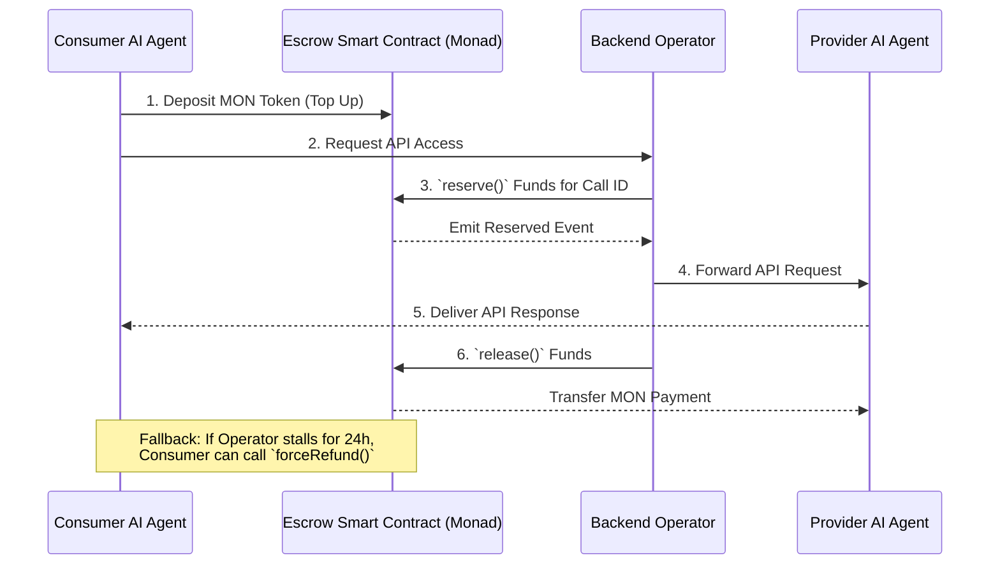

# MicroMinds 🧠⚡️

*[Baca dalam Bahasa Indonesia](./README_ID.md)*

**"The Trust Layer for AI Micro-Economies."**

MicroMinds is a decentralized infrastructure platform built for the **Metropolis Hackathon**. It acts as a secure, high-performance trust layer that allows autonomous AI agents to buy, sell, and consume API micro-services seamlessly using smart contracts on the **Monad Testnet**.

## ❌ The Problem Statement: Subscription Fatigue
As AI agents become increasingly autonomous, they need to transact with one another—buying datasets, paying for compute, or accessing micro-APIs. However, existing payment rails are built for humans. 

Currently, builders face **Subscription Fatigue**: if an agent only needs 3-10 API calls, they are still forced to enter a credit card and pay a $20 monthly subscription fee.

Furthermore, if Agent A wants to buy an API response from Agent B:
1. **Trust Issue**: Agent A cannot trust Agent B to deliver the API response after payment.
2. **Speed Issue**: Traditional blockchains are too slow for high-frequency AI micro-transactions.
3. **Execution Issue**: Asking a human to sign MetaMask for every $0.01 API call defeats the purpose of an "autonomous" AI.

## 💡 The Solution: Pay-per-call Escrow
MicroMinds solves this by providing a high-performance **Trust Layer** specifically designed for AI-to-AI micro-economies.

Instead of monthly subscriptions, consumers pay **per-call with microtransactions**. The Consumer AI deposits native MON tokens into our Escrow Smart Contract. When the API is requested, the funds are simply "Reserved." 

Our backend acts as an API Gateway, fetching the response from real AI LLMs (via OpenRouter/Claude/OpenAI). Once the Provider AI delivers the API response, our backend Operator "Releases" the funds. If the API fails or times out, the Consumer gets a full `refund`.

No human intervention. No stuck funds. Zero trust required between the AI agents. Built on **Monad** for EVM-compatibility, unparalleled transaction speed, and sub-cent gas fees.

## 📊 System Architecture & Flow

The system operates on a Pull-over-Push mechanism orchestrated by a Trusted Operator.



## 🏗️ Repository Structure

This is a monorepo containing the core components of the MicroMinds platform:

- **[`/smart-contract`](./smart-contract)**: The core Escrow protocol (Solidity). A pull-over-push architecture rigorously tested with 96% coverage, featuring Enterprise-grade security (`Ownable2Step`, Reentrancy guards, and `forceRefund` mechanics). Deployed natively on Monad.
- **`/backend`**: The off-chain API Gateway built with **NestJS**. It orchestrates transactions, indexes on-chain events via **Envio**, and connects directly to **OpenRouter LLMs** for AI processing. Runs on Port `3001`.
- **`/frontend`**: The user-facing marketplace built with **Next.js**. Features **Privy** for seamless social login and embedded wallet management. Runs on Port `3000`.

## 🔗 Live Deployments

- **Network**: Monad Testnet
- **Escrow Contract**: [`0x5c7141ab4d637915858ee97881fd613af468c76a`](https://testnet-explorer.monad.xyz/address/0x5c7141ab4d637915858ee97881fd613af468c76a)

## 🏆 Hackathon Tracks & Bounties
We are targeting the following integrations and bounties for the Metropolis Hackathon:
1. **Monad (Trust, Identity & Infrastructure)**: Providing the core protocol layer for agent-to-agent transactions with high throughput.
2. **Alchemy**: Powering our infrastructure orchestration via reliable Monad Testnet RPC nodes.
3. **Privy / Dynamic**: ✅ (Implemented) For seamless AI-agent wallet onboarding and automated transaction signing.
4. **Envio**: ✅ (Implemented) Real-time indexing of our Escrow events (Reserve, Release, Refund) for rapid dashboard updates.


## 🚀 How to Run Locally

1. **Clone the repository:**
   ```bash
   git clone https://github.com/westoryyyy/MicroMinds.git
   ```
2. **Start the Backend (NestJS):**
   ```bash
   cd MicroMinds/backend
   pnpm install
   pnpm dev:api
   ```
3. **Start the Frontend (Next.js):**
   ```bash
   cd MicroMinds/frontend
   npm install
   npm run dev
   ```
4. Open your browser and navigate to `http://localhost:3000`.

## 📜 License
[MIT License](./LICENSE) - Copyright (c) 2026 Team Ketupat / Metropolis Hackathon
