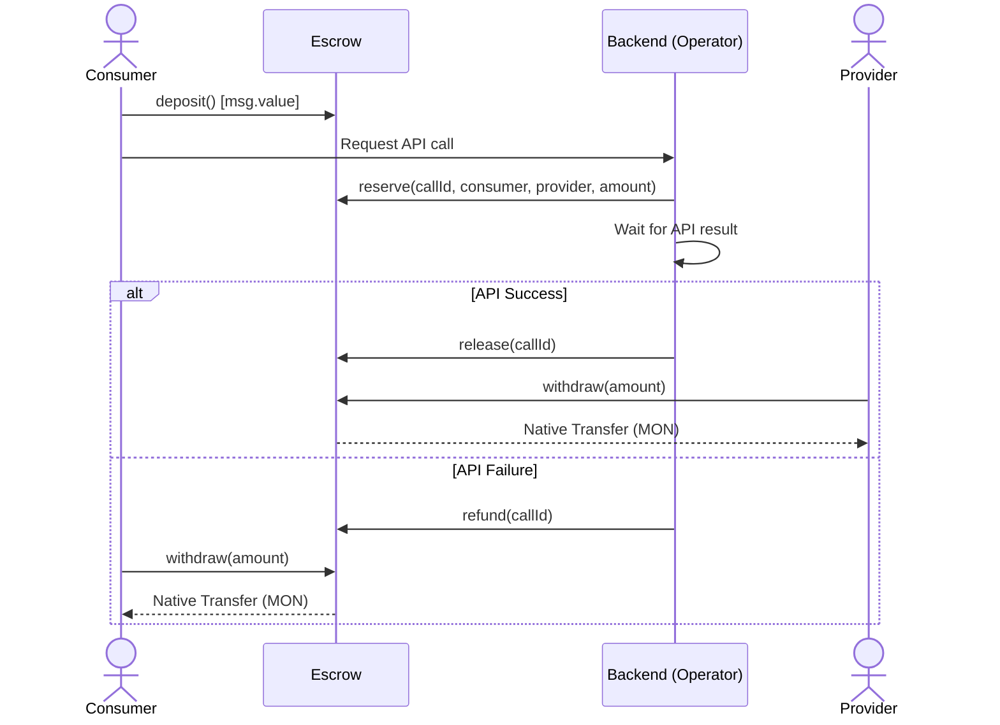
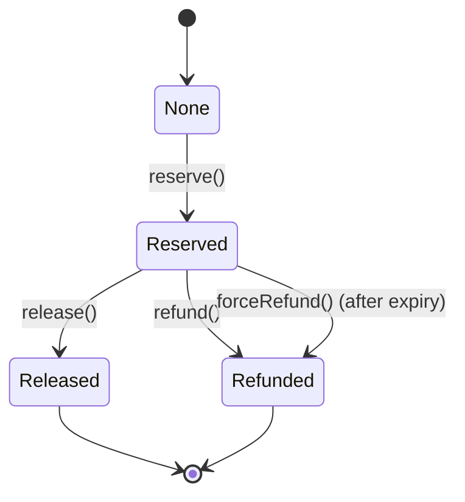

# MicroMinds Escrow Contract

A pull-over-push escrow smart contract for the MicroMinds Metropolis Hackathon on Monad Testnet. This contract safely holds consumer native token deposits (MON), allowing an off-chain operator to orchestrate reservations and releases (or refunds) for API usage.

## Architecture & Flow
1. **Deposit**: Consumers deposit MON into their contract balance.
2. **Reserve**: Operator locks a specific amount from the consumer's balance for a unique `callId`.
3. **Release/Refund**: After the API call completes, the operator either releases the funds to the provider or refunds them to the consumer.
4. **Withdraw**: Consumers and providers withdraw their available MON balances at their own convenience.

### Sequence Diagram



## Contract Interface

### Functions

| Function | Access | Effects | Reverts On |
|----------|--------|---------|------------|
| `deposit()` | Public | Increases `balances[msg.sender]` by `msg.value`. | N/A |
| `withdraw(uint256 amount)` | Public | Decreases `balances[msg.sender]` by `amount`, sends native token. | `ZeroAmount()`, `InsufficientBalance()`, `TransferFailed()` |
| `reserve(bytes32 callId, address consumer, address provider, uint256 amount)` | Operator | Decreases `balances[consumer]`, creates a `Call` struct with status `Reserved` and sets `expiry`. | `NotOperator()`, `ZeroAmount()`, `ZeroAddress()`, `CallAlreadyExists()`, `InsufficientBalance()` |
| `release(bytes32 callId)` | Operator | Sets call status to `Released`, increases `balances[provider]`. | `NotOperator()`, `CallNotReserved()` |
| `refund(bytes32 callId)` | Operator | Sets call status to `Refunded`, increases `balances[consumer]`. | `NotOperator()`, `CallNotReserved()` |
| `forceRefund(bytes32 callId)` | Consumer | Sets call status to `Refunded`, increases `balances[consumer]`. Callable only after expiry. | `CallNotReserved()`, `NotConsumer()`, `CallNotExpired()` |
| `setOperator(address newOperator)` | Owner | Updates the operator address. | `OwnableUnauthorizedAccount()`, `ZeroAddress()` |

### Events

| Event | Parameters | Indexed |
|-------|------------|---------|
| `Deposited` | `account`, `amount` | `account` |
| `Withdrawn` | `account`, `amount` | `account` |
| `Reserved` | `callId`, `consumer`, `provider`, `amount` | `callId`, `consumer`, `provider` |
| `Released` | `callId`, `provider`, `amount` | `callId`, `provider` |
| `Refunded` | `callId`, `consumer`, `amount` | `callId`, `consumer` |
| `RefundedForcibly` | `callId`, `consumer`, `amount` | `callId`, `consumer` |
| `OperatorUpdated` | `oldOperator`, `newOperator` | `oldOperator`, `newOperator` |

## Call State Machine



## Roles & Trust Model

- **Owner**: The deployer. Capable of changing the operator address. Cannot access user funds directly.
- **Operator**: The trusted backend service executing reservations and releases.
- **Consumer**: Depositors who request API usage.
- **Provider**: Entities fulfilling the API usage.

> **CRITICAL MVP TRUST ASSUMPTION**: In this MVP, the Operator is **fully trusted**. The operator has the power to reserve and release *any* consumer's balance to *any* provider without explicit cryptographic approval from the consumer for each call. Consequently, a compromised operator key could drain consumer balances to an arbitrary provider. For this reason, the **Owner and Operator MUST be separate wallets**, allowing the owner to rotate a compromised operator key.

## Security Considerations

- **ReentrancyGuard**: Applied to `withdraw` to prevent recursive reentrancy.
- **Checks-Effects-Interactions (CEI)**: Applied across the contract state changes.
- **Pull Payments**: The contract uses a pull-over-push model. Funds are never pushed automatically; users must initiate withdrawals.
- **Direct Payment Rejection**: The contract safely rejects arbitrary native token transfers utilizing `receive()` and `fallback()` reverting mechanisms.
- **Custom Errors**: Usage of custom errors to minimize gas usage over standard require statements.
- **Timeout/Expiry**: To prevent funds from being permanently stuck if the Operator goes offline, every reserved call automatically receives a 1-day expiry. Consumers can call `forceRefund()` after this period to reclaim their funds.

### Monad-Specific Considerations
- **Gas Deductions via Limit**: Monad deducts gas based on `gas_limit` rather than `gas_used`. When interacting with the contract, ensure the gas limit is set accurately to avoid over-paying MON.
- **Reserve Balance Rules**: Monad enforces a 10 MON reserve balance at the EOA level. This restriction does *not* apply to the internal `balances[]` mapping of the contract. However, the deployer, operator, and interacting EOAs must retain a minimum of 10 MON in their native wallet balance to prevent revert at execution time.

### Known Limitations
- The operator is a single point of failure and acts as a central authority for funds.
- There are currently no boundaries regarding how much an operator can reserve.
- Test coverage is currently at **0%** across **0 tests**. We do not make any security guarantees until full coverage is completed.

## Getting Started

### Prerequisites
- [Foundry](https://book.getfoundry.sh/getting-started/installation) (v1.8.0 or newer). Must be installed via the official installer to properly support Monad execution environments.

### Install & Build
```bash
forge install
forge build
```

> Note: The `foundry.toml` uses `network = 'monad'` which ensures `forge` accurately simulates Monad execution behavior.

### Test & Coverage
```bash
forge test
forge coverage
```

### Formatting
```bash
forge fmt
```

## Environment Variables

Copy `.env.example` to `.env` and fill the variables:

| Variable | Description |
|----------|-------------|
| `ALCHEMY_RPC_URL` | Monad testnet RPC endpoint (e.g. `https://monad-testnet.g.alchemy.com/v2/...`) |
| `OPERATOR_ADDRESS` | The wallet address acting as the trusted operator. |

## Deployment to Monad Testnet

Deployment is handled via Alchemy RPC endpoints.

1. Ensure your `.env` contains the correct `ALCHEMY_RPC_URL` and `OPERATOR_ADDRESS`.
2. Ensure you have two separate keys/keystores for the Deployer (Owner) and Operator.
3. Run the deployment script (currently in development):
   ```bash
   # <TO_BE_FILLED> (Deployment commands utilizing forge script)
   ```
4. Extract the ABI and deployments using the export script:
   ```bash
   ./script/export-deployment.sh
   ```
   This generates `deployments/monad-testnet.json`.
5. Perform smoke tests:
   ```bash
   ./script/smoke.sh
   ```
   *Note: Ensure the testing wallets have >= 10 MON to accommodate the Monad Reserve Balance.*
6. Verify the contract on [MonadVision](https://monadvision.xyz) / Monadscan:
   ```bash
   # <TO_BE_FILLED> (Verification command using forge verify-contract)
   ```

## Deployed Contracts

| Network | Address | Start Block | Explorer |
|---------|---------|-------------|----------|
| Monad Testnet | `<TO_BE_FILLED>` | `<TO_BE_FILLED>` | `<TO_BE_FILLED>` |

## Testing Strategy

Currently, the test suite is empty (**0 tests, 0% coverage**). The planned testing strategy encompasses:
- **Unit Testing**: Testing individual access controls, balance logic, state transitions.
- **Fuzz Testing**: Testing unexpected amounts and addresses.
- **Invariant Testing**: Ensuring total balances in mapping matches contract balance; ensuring call lifecycle strictly adheres to `None -> Reserved -> Released/Refunded`.
- **Reentrancy Testing**: Verifying the `withdraw` protection.

To run:
```bash
# <TO_BE_FILLED> (Examples of running specific test segments)
```

## Project Structure
```text
monad-contracts/
├── .env.example
├── README.md
├── foundry.toml
├── deployments/
│   └── abi-skeleton.json
├── docs/
│   ├── ESCROW_SPEC.md
│   └── SOURCES.md
├── lib/
├── script/
│   └── <TO_BE_FILLED> (export-deployment.sh, smoke.sh)
├── src/
│   └── Escrow.sol
└── test/
    └── <TO_BE_FILLED> (Escrow.t.sol)
```

## Audit and Security Review

<TO_BE_FILLED>

## Roadmap

Future iterations of this Escrow should incorporate:
- On-chain provider registry.
- Multi-sig or timelock requirements for the operator.
- Configurable limits on the amount per reserve.
- Explicit consumer authorization via spending caps or signatures per request.
- Decentralized validation instead of a single trusted operator.

## License

<TO_BE_FILLED>
