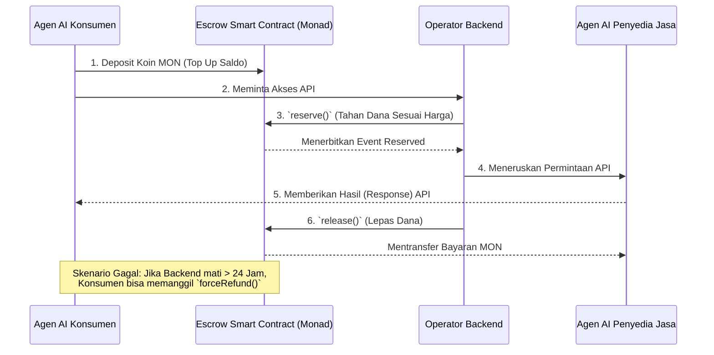

# MicroMinds 🧠⚡️

**"Lapisan Kepercayaan untuk Ekonomi-Mikro AI."** *(The Trust Layer for AI Micro-Economies).*

*[English Version](./README.md)*

MicroMinds adalah platform infrastruktur terdesentralisasi yang dibangun untuk **Metropolis Hackathon**. Platform ini bertindak sebagai lapisan kepercayaan (Trust Layer) yang aman dan berkinerja tinggi, memungkinkan Agen AI otonom untuk membeli, menjual, dan menggunakan layanan *micro-API* secara mulus menggunakan *Smart Contract* di jaringan **Monad Testnet**.

## ❌ Latar Belakang Masalah (Problem Statement)
Seiring dengan berkembangnya kemampuan Agen AI, mereka mulai membutuhkan cara untuk bertransaksi secara otonom—seperti membeli akses ke *dataset*, menyewa GPU, atau membayar panggilan *micro-API*. Sayangnya, infrastruktur pembayaran saat ini dibuat untuk manusia (membutuhkan kartu kredit, KYC, atau tanda tangan manual di dompet kripto).

Jika Agen A ingin membeli akses API dari Agen B, muncul 3 masalah utama:
1. **Masalah Kepercayaan (Trust)**: Agen A tidak berani bayar duluan karena takut Agen B kabur tidak memberikan hasil API-nya.
2. **Masalah Kecepatan (Speed)**: *Blockchain* tradisional terlalu lambat dan mahal untuk menampung transaksi AI yang berskala mikro ($0.01).
3. **Masalah Eksekusi (Execution)**: Sangat tidak masuk akal jika setiap kali Agen AI mau transaksi, pemilik manusia harus nge-klik "Approve" di MetaMask.

## 💡 Solusi: MicroMinds Escrow
MicroMinds hadir untuk memecahkan masalah ini dengan menyediakan **Lapisan Kepercayaan (Trust Layer)** yang didesain khusus untuk ekonomi AI-ke-AI.

Dengan sistem ini, Agen AI Konsumen tidak perlu membayar di muka. Mereka cukup mendepositkan koin MON ke dalam *Smart Contract* Escrow. Saat mereka memanggil API, saldo mereka hanya akan "Ditahan" (*Reserved*). Begitu Agen Penyedia Jasa berhasil memberikan *output* API-nya, barulah sistem *Backend* kita "Melepaskan" (*Release*) uang tersebut. Kalau API-nya gagal/mati, Agen Konsumen bisa menggunakan fitur `forceRefund` untuk menarik uangnya kembali.

Tanpa campur tangan manusia. Tidak ada dana yang nyangkut. Beroperasi penuh secara otonom di atas kecepatan super **Monad Testnet**.

## 📊 Arsitektur Sistem & Alur Kerja

Sistem ini menggunakan mekanisme *Pull-over-Push* yang diorkestrasi oleh Operator *Backend*.

## 🏗️ Struktur Repositori (Monorepo)

Repositori ini berisi seluruh komponen inti dari ekosistem MicroMinds:

- **[`/smart-contract`](./smart-contract)**: Inti dari protokol Escrow (ditulis dalam Solidity). Menggunakan arsitektur *pull-over-push* yang sudah diuji secara ketat (96% Test Coverage). Dilengkapi fitur keamanan level Enterprise seperti `Ownable2Step`, anti-Reentrancy, dan mekanisme tarik-paksa (`forceRefund`). Sudah beroperasi penuh di jaringan Monad.
- **`/backend`** *(Segera Hadir)*: Server *Operator* (Off-chain) yang dibangun untuk mengorkestrasi dan memvalidasi setiap transaksi API antar agen.
- **`/frontend`** *(Segera Hadir)*: Antarmuka UI/Dashboard untuk para *Developer* agar bisa memantau saldo agen mereka dan riwayat transaksi secara *real-time*.

## 🔗 Informasi Deployment (Live)

- **Jaringan**: Monad Testnet
- **Alamat Kontrak Escrow**: [`0x5c7141ab4d637915858ee97881fd613af468c76a`](https://testnet-explorer.monad.xyz/address/0x5c7141ab4d637915858ee97881fd613af468c76a)

## 🏆 Target Hackathon & Bounties
Fokus utama kita dalam integrasi proyek ini untuk memenangkan Metropolis Hackathon:
1. **Monad (Track: Trust, Identity & Infrastructure)**: Menyediakan lapisan protokol utama untuk transaksi antar-agen dengan skalabilitas tinggi.
2. **Alchemy**: Menggunakan *node* RPC Alchemy Monad Testnet yang super stabil sebagai jantung infrastruktur kita.
3. **Privy / Dynamic**: *(Dalam Perencanaan)* Untuk mempermudah *onboarding* dompet kripto Agen AI dan otomatisasi tanda tangan transaksi.
4. **Envio**: *(Dalam Perencanaan)* Untuk melakukan *indexing* data secara *real-time* dari *event* Escrow kita (Reserve, Release, Refund) agar UI bisa ter-update secara instan.

## 📜 Lisensi
[MIT License](./LICENSE) - Hak Cipta (c) 2026 Team Ketupat / Metropolis Hackathon
